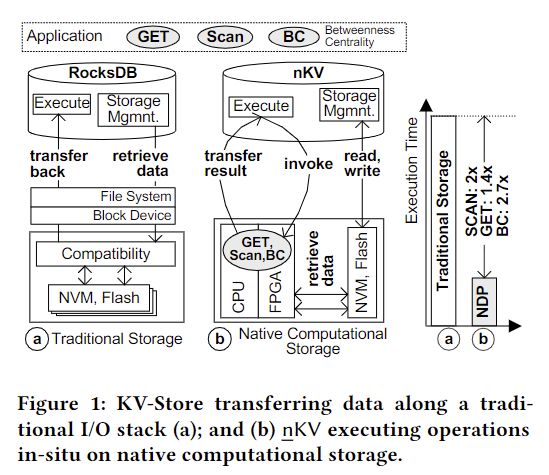

# nKV: Near-Data Processing with KV-Stores on Native Computational Storage

现代KV存储中大量的数据迁移来源于低效的数据局部性，data-to-code的系统设计也降低了数据迁移的性能以及可扩展性。NDP的出现可能提供新的解决方法。这篇论文提出了nKV，其利用了CSD以及NDP技术。nKV可以直接控制底层硬件上的数据以及计算，其将数据格式以及布局信息传播到部署了软硬件解析器和访问器的存储设备中。nKV可以采用无主机干预的方式直接在物理地址上执行NDP操作，更好地利用了底层的硬件资源。论文中nKV的性能评估基于传统KV操作*GET、SCAN*以及复杂的图处理算法*Betweenness Centrality*，在COSMOS+OpenSSD平台上实现了1.4x到2.7x的性能提升。

## Introduction

NDP是一种[code-to-data](https://www.michaelmanagement.com/help/what-is-the-code-to-data-application-programming-paradigm)范式，聚焦于原位操作执行。换句话说，操作的执行要尽可能接近物理数据位置，利用更好的设备上I/O性能。硬件制造商将存储与计算结合打包在相同的设备中——NDP-capable computational storage。因此即便是商用存储设备，也有一定的计算资源可以被有效应用在NDP中。

持久化key-value数据存储例如LevelDB或者RocksDB都依赖与传统的分层存储堆栈，这样简化了结构，获得了更高的灵活性以及简化了数据管理。然而DBMS内部的存储管理、访问方法以及底部的文件系统、操作系统封装了成功利用NDP所需要的信息和功能。首先，在设备上执行NDP操作需要被处理数据实际的物理地址。在传统的存储系统中，地址信息分散在存储栈的各层级中（DBMS、File System、OS）。其次，NDP操作需要浏览并解析设备上的数据，为此设备上需要设置数据格式以及布局访问器。然而，数据格式的定义只在DBMS中，且有时仅在上层的应用中。此外，对于文件或者LSM-tree的数据布局（page、record）以及遍历方法通常在DBMS中硬编码，在设备中并不可用。

文章提出nKV，nKV消除了I/O堆栈上的中间层（例如文件系统）并直接在NVM/闪存上运行。nKV直接控制芯片和通道上的物理数据放置，这对于利用设备上的I/O特性和计算并行性至关重要。此外，nKV可以执行多种操作例如GET、SCAN以及复杂的Betweenness Centrality算法，在ARM核上作为software NDP，在基于FPGA加速器上作为hardware-softwareNDP。必要的FPGA硬件以简单的处理元素的形式构建，可用于从arm核心中加载某些任务。在nKV下，目标是无主机干预的NDP执行，即NDP设备具有完整的地址信息，可以解释数据格式，并在不需要主机交互的情况下在现场访问数据。为了降低数据迁移，nKV采用了ResultSet-transfer模型。

## Background

主要介绍了基于LSM-tree的key-value存储的基本概念，插入、查找等基本步骤。nKV构建在RocksDB上，它每列族引入一个独立的LSM-Tree来分离不同数据库对象的访问特征。对于value进行谓词判断的SCAN操作，唯一的选择是遍历整个数据集，将使I/O大量增加，通过NDP可以改善这一现象。

## ARCHITECTURE OF nKV

#### Native computational storage

本机存储是指沿关键I/O路径没有中间/兼容性抽象层的存储，直接由数据库控制。这意味着nKV可以使用物理地址直接在NVM/闪存存储上进行操作，从而可以精确地控制SST数据的物理位置。正是这种物理位置允许利用设备上的I/O带宽和FPGA的计算并行性。

nKV会将SST数据块和SST索引块分别放置在不同的lun和通道上。这允许通过异步请求索引和数据块，并利用基于FPGA的处理元素(PEs)的处理并行性来达到内部带宽。此外，LSM-Tree的每层在不同chips和LUNs上物理分离，以提高I/O吞吐量和并行性，因为占用大量I/O的compaction操作不会阻塞整个设备，这降低了总线上的需求压力。此外，nKV直接使用物理地址进行操作，以精确地访问（读取或写）所需的物理页面。反过来，这对于减少读取和写放大也至关重要。

#### **Computation Placement**

通过使用本地计算存储，nKV可以直接将计算放置在异构的设备上的计算元素上，如arm核或基于FPGA的处理元素。对于NDP操作，nKV利用硬件/软件的协同设计来处理适当的任务分离，并达到最佳的性能。

### NDP Interface Extensions

nKV具有专用的高性能用户空间和DBMS内的NVMe层。本机NVMe集成可以通过专用线程或通过事务上下文控制多个NVMe提交和完成队列。此外，深度的数据库集成还避免了用户空间和内核空间之间昂贵的同步，并进一步缩短了I/O路径，因为沿着关键访问路径不涉及任何驱动程序。在内部，本机存储指令被传输到指定的NVMe I/O以及NDP任务。除了经典的本机存储接口之外，nKV还根据一个通用的NDP_EXEC()命令引入了NDP-扩展名。其中包括以下参数：

| parameter                          | meaning                           |
| ---------------------------------- | --------------------------------- |
| Command Identifier                 | NDP函数的唯一标识符               |
| the SearchKey or SearchKeyRange(s) | 服务于GET和SCAN操作               |
| the ResultsSet Size                | 结果集大小                        |
| AddressMappings                    | 实际被处理数据的物理地址          |
| Min/Max Keys                       | RocksDB支持zone map，用来优化查询 |
| Miscellaneous                      | 特殊指令参数，例如数据格式定义    |

nKV根据给定的参数、当前状态和地址信息及其事务上下文组成NVMe命令。将其置于NVMe提交队列中，DMA将参数传输到设备后，然后执行NDP命令。结果集由结果集处理器处理，该处理器还会观察执行状态。最后，结果集通过DMA引擎转移到nKV。

### In-situ Data Access and Interpretation

在nKV下，NDP设备可以解释数据格式并访问数据，无需主机干预（与主机同步）。nKV可以提取键值对的定义并将其作为输入参数传输给NDP指令。nKV在设备上有一个NDP基础设施层用于执行和简化NDP操作命令的开发。该层由数据格式解析器以及访问器组成，软硬件都进行了部署。

为了执行一个*GET(key)*操作，nKV首先辨认对应的SST并激活一个*NDP_GET*命令，该命令带有对应的数据物理区间，key，value格式以及其他参数。首先SST 布局访问器被启动用来访问数据块以及索引块。接着，索引块解析器被激活用于解析数据以及验证对应的key是否存在并提取offset。如果存在，数据块访问器和解析器会被激活去提取KV entry。对于*NDP_SCAN(key_val_condition)*操作，KV访问器随后被激活用于提取kv对，field解析器用来提取value并判断是否满足条件。这样，nKV扩展了传统KV-Store仅支持基于key的scan操作，现在支持了涉及value的过滤谓词。

### **Operations and Algorithms**

主要就是对于value-embedded属性的scan没有辅助的数据结构用来加速。取决于过滤谓词的选择性，众多数据块将被检查，因此scan操作通常会导致大量的数据迁移，利用NDP可以很好的降低。

### **Data Consistency, Database Maintenance and NDP**

NDP的操作执行在物理数据的快照上，并发修改不会影响一致性，底层通过Copy-on-Write机制、精确的接口配置以及nKV对于物理GC的直接控制来实现。

### **Result Set Handling**

取决于如何返回NDP操作的结果，可能会发生不必要的数据传输，对结果集的额外管理有助于避免处理资源不必要的延迟。nKV旨在减少由*Volcano-style record-at-a-time*模型造成的数据传输开销。相反，它旨在批量转移结果集。前者更简单，但会导致更频繁的更短的突发传输，从而导致总线开销。后者利用吞吐量优化PCIe产生更少但更长的突发。

## **HARDWARE-ARCHITECTURE**

COSMOS+是一个基于PCIe的扩展卡。它包含了作为基于NVMe的常规SSD发挥功能所需的所有硬件模块。这个基础设施由两个独立的域组成：第一个是负责访问flash内存，包括一个或多个具有相应的低级别flash接口的Tiger4控制器。对于每个通道，都需要一个独特的Tiger4控制器，以及一个低级接口。第二个域主要包含一个NVMe-core，它允许通过NVMe接口从主机访问到设备。NVMe-Core还封装了实际的低级PCIe接口。

## **HARDWARE-ACCELERATION**

使用基线架构（图5)部署了特殊的处理单元PEs，允许将计算从运行在arm核心上的软件移动到SoC的可编程逻辑，潜在地提高了延迟、吞吐量和可用的并行性。PEs是用Chisel3编写的，使用了一个相对简单的架构，可以细分为四个不同的域。

- **The control-domain**：
  由一个寄存器文件组成，持有许多控制寄存器，可以使用AXI4-Lite接口访问。相应的地址被映射到处理系统(PS)的地址空间，以便arm核可以读取和写这些寄存器，从而控制和控制。
- **The memory-domain**：
  包含一个负载和一个存储单元。这些都连接到PSs DRAM接口，允许PE访问设备DRAM。这些传输是使用AXI4执行的，以最大化吞吐量。
- **The accessor-domain**：
  负责在内存和计算域之间转换不同的数据粒度(64位字vs元组)。
- **The computational domain**：
  是由两个截然不同的模块组成的。第一个是过滤单元，接受单独的kv对作为输入，依靠控制寄存器，过滤单元随后将符合条件的kv对传输给数据转换单元，丢弃不符合过滤条件的kv对。最后一个模块会将数据转换为所需的输出格式。

对于所选的数据集建立了两个不同的处理单元，paper-PE以及ref-PE，最后实现时构建了七个ref-PE，一个paper-PE。具体内部构造论文中未提及。

## **EVALUATION**

通过PCIe 2.0 x8将COSMOS+板作为NVMe块设备，支持Greedy FTL，主机端使用3.4 GHz Intel i5, 4GB RAM，Debian 4.9 with ext3。使用5MB cache部署RocksDB以及COSMOS+，COSMOS+被映射到用户空间。性能评估基于2.4GB的研究论文图数据集，来自微软学术图。实验的baseline是在GreedyFTL和ext3之上使用块设备存储(Blk)的RocksDB。GET(key)、SCAN(value_predicate)和BC性能结果通过三种不同的堆栈测试：Blk作为基线，ARM上的软件NDP(NDP：SW)、FPGA辅助的NDP(NDP：SW+HW)。

对于GET()、SCAN()和BC()都能提高2x左右的性能

