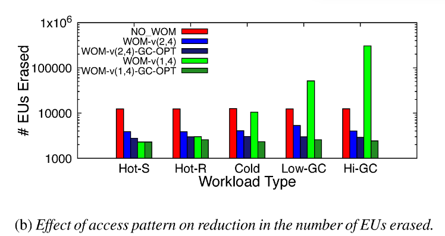

# Improving the Reliability of Next Generation SSDs using WOM-v Codes

本工作来自多伦多大学和谷歌合作Shehbaz Jaffer，发表于FAST 2022，Best Paper。作者测试发现binary-WOM编码下，存储单元中比特数量与其能够支持的重编程次数成反比关系。存储单元每多增加一个比特，可实现的重编程次数少一个数量级。 为了解决下一代高密度闪存低耐久性带来的可靠性挑战，提出新的编码WOM-v (Voltage-based Write-Once-Memory)，来提高SSD的使用寿命。通过重编程的方式，增加擦除操作间的编程次数来应对高密度闪存有限擦除次数的瓶颈问题。

## 背景

随着闪存密度的增加，其可承受的擦除次数逐渐减少。如下图所示。QLC的擦除次数不到1000次，而PLC仅为几十至几百次。特别是存储单元尺寸小，擦除次数就更少了。针对这个问题，本文将从WOM编码的角度探索如何通过增加重编程次数来降低擦除次数。

图1：随着存储密度增加而减少的可擦写次数

### Binary-WOM codes

Binary-WOM应用于较早的存储设备上，例如Punch Card。在这类介质上，数据以位为粒度写入，并且一旦写入，位只能在一个方向上更改。例如，只能从比特0变换到比特1。表1和表2给出的是WOM(2,3)和WOM(2,4)，对于WOM(2,3)，表示数据存储两位，但实际存储三位。如表1所示，每个data都有Gen1和Gen2两种表示方式，对于每两位都能编程两次，因此，通过这种方式，两次编程后，实际写入的数据为2+2=4bits,比占用存储的3bits多。

然而，Binary-WOM不适合新一代的闪存，如QLC。对于闪存存储单元的真正限制是，电压值总是增加(达到最大电压Vmax)，但不能降低，这与编码的位值无关。坚持采用二进制模型会产生不必要的约束。
对于QLC闪存，经过作者的测试发现，使用WOM(2,4)编码方案无法写入超过2代的数据，因此，在QLC上每两次写入就需要一个擦除操作。此外，由于2位数据被编码成4位，代码有2倍的空间放大。所以在QLC中使用Binary-WOM没有净增益。

## 设计

### WOM-v Code

为了解决上述问题，本文设计了新的编码 **WOM-v (Voltage-based Write-Once-Memory)** ，实现更高的写入量。WOM-v码借助于闪存编程的特征(往存储单元中存储电荷)。编程以ISPP方式总是由低电压编程到高电压。因此，可以将电压分布范围划分成多个GEN，一个GEN中包含的电压区间表示一次编程可以到达的电压值。以QLC为例，存储单元中存储4个比特，可以形成16种电压状态（V0-V16）。如下图所示，可以有WOM-v(3,4), WOM-v(2,4), WOM-v(1,4)。事实上，WOM-v(3,4)就是将QLC看作TLC使用，用户存储3个数据字，而实际存储4位码字。由于每次表示3位，因此单次编程只需要8个状态。这样QLC的16个状态就可以编程两次。更高阶WOM-v(2,4)则可以编程16/4=4次。

基于上述思想，有以下几个优化点：

- **同代转换：** 是指重编程后，存储单元的电压状态还在同个GEN中。具体来说，在编程时，若编程后的DATA可以用当前电压值和当前GEN的最大电压值之间的电压状态表示时，同一个GEN内部也可以重编程。例如，当前是001(V1)，编程后为101。那么无需进入GEN2，编程到GEN1中的V5即可，并做好记录；–》此优化点的问题是会产生写前读，每次重编程之前需要通过一次读取来确定存储单元的电压状态。本文进一步提出NR模式来权衡是否采取此优化点。
- **码字共享：** WOM-v(3,4)中的电压状态V7在GEN1和GEN2之间是共享的。数据111在GEN1和GEN2中都映射到V7。这种共享让我们可以挤出更多的重编程代数。例如，WOM-v(2,4)原先是4代，共享后为5代。
- **利用ECC容错空间：** 当写发生在页面的粒度(而不是存储单元)上时，一旦页面的任何一个存储单元达到GEN_MAX，就不能再重编程。当页面中少量存储单元达到GEN_MAX的情况下，继续进行页面重编程而不擦除。要实现上述目标，可以利用设备中的ECC纠错码的容错空间。通过标记少量已达到GEN_MAX的存储单元为无效，剩余存储单元组成的页面可继续执行重编程。而这些标记无效的存储单元的值可以通过现有ECC来确定。

## 系统实现

本文在Linux LightNVM Open-Channel SSD子系统模块中实现了WOM-v码，它允许在FTL中进行更改。并扩展FEMU来模拟QLC设备。通过WOM-v的系统实现，可以测试在SSD中实际减少的擦除次数(以EU为粒度执行擦除操作)，以及评估在理论上无法准确收集的input data contents、workload patterns和performance overhead。

### LightNVM架构

LightNVM是一个Linux模块，它向主机公开了NVMe SSD的底层体系结构。有助于对读写方式进行修改，也能够控制垃圾回收，以及何时应该在底层设备上执行擦除操作。LightNVM的内部体系结构如图3所示。LightNVM模块的两个主要数据结构是1) Ring Buffer和2) Parallel Units。

#### **基于LightNVM的WOM-v code实现**

要将WOM-v码合并到LightNVM代码中，需要做以下更改：
1）对设备的所有写入操作都需要进行编码。
2）发布给设备的所有读取都需要解码以前编写的数据。编码和解码涉及到简单的表查找
3）需要修改默认的垃圾回收逻辑。原先在垃圾回收过程中擦除所有的擦除单元（EU），现在应该根据EU内部页面的状态（是否达到GEN_MAX）有选择地进行擦除。
4）底层设备模拟器需要支持下一代具有QLC或更密集的闪存介质的SSD设备。
5）本文进一步实现了两种优化，GC_OPT和NR模式，有助于提高性能和减少WOM-v的开销。

#### **基本实现**

将以下组件添加到LightNVM模块中（在图3中以绿色突出显示）：1) 编码和解码逻辑；2) WOM-v感知的垃圾收集逻辑；3) 基于FEMU的QLC支持。

**1. 写入操作：** 所有写数据在写入设备之前都进行编码。默认情况下，WOM编码首先读取设备上先前写入的数据（查看当前编程到哪一代了）。该数据在物理页面上进行编码和覆盖，以维护底层介质基于电压的约束。这种默认方法会导致读放大。
在写操作过程中，在将环形缓冲区数据写入设备之前，在环形缓冲区中暂存页面的逻辑块地址(LBA)与设备物理页地址(PPA)之间创建一个映射。在此阶段，拦截所有的写操作，并执行以下转换：1）对正在写入的所有页面的PPA中读取预先存在的编码数据；2）使用现有的数据对页面进行再编码；3）将新的编码页面写入设备。
**2. 读取操作：** 所有被读取的编码页面都在读取返回路径中被解码。解码后的数据被复制到最初提交的bio请求中，并且可以被应用程序读取而无需修改。
**3. 垃圾回收：** 传统的GC是回收有效页面后直接擦除才能使用，然而本文使用的WOM-v码下，页面可重编程。因此只有当EU中任何一个页面达到最大可重编程次数后才会被擦除。所以每次GC只需要回收有效页面而不需要执行擦除操作。
**4. Cell and Page Layout：** 除了前面提到的数据编码外，我们还改变了存储单元分配给页面的方式。传统上，对于一个N级存储单元设备，1个存储单元存储N位的数据，其中每个位位于N个不同的页面上。例如，在QLC闪存中，1个存储单元存储4位信息，每个位位于设备的4个不同页面中。这种方法的缺点是，这4页必须按照一定的顺序进行编程。对于WOM-v代码，我们建议在单个页面中映射代表1个存储单元的4位信息。这个映射可以将页面的单个存储单元编程为我们选择的电压值。使用这种技术，对于一个WOM-v（2,4），我们将能够将4KB的逻辑页面编码为8KB的数据，并将这些数据存储在闪存的2K个存储单元中。类似地，对于一个WOM-v（1,4)代码，1个4KB的逻辑页面将被编码为16KB的数据，并被写入4K个存储单元。上述方法的含义是，我们不再需要维护页面编程的特定顺序。相反，单个页面上的每个存储单元都可以被编程到由写入时存储单元Gen所决定的特定电压范围。

#### **WOM-v优化**

一个WOM-v(k,N)方案可以自然地扩展到任何N级存储元，通过将N的值更改为设备的每个存储元的位数。k的值决定了容量和寿命的权衡——较低的k值会产生更高的闪存寿命，但也会消耗更多的物理空间。

**GC_OPT模式：** 解决GC期间有效页面回收带来的写放大问题，进一步提高了SSD的耐久性。关键的观察是，在大多数情况下，如果EU中的无效页面可以被重写，则无需执行擦除。这意味着，在EU不需要擦除的情况下，我们可以保留有效页面，只要我们在未来写入EU时跳过这些有效页面。块中剩余的无效页面将以与以前相同的特定顺序被覆盖，以减少单元间的干扰，并像以前一样在EU的并行单元上条带化写入。

**No_Read(NR)模式：** 由于采用同代转换，在数据写入存储元之前，需要知道存储元的内容，确定其处于哪一代的哪一个电压状态。因此，每次写都需要先读一次。**如何消除写前读**：去掉同代转换，只在GEN之间转换。通过记录当前编程的代数，下一次编程直接跳转到下一代。NR模式可优化性能，但对耐久性有轻微影响。

## 实验评估

### **Micro Benchmarks**

#### **1. Effect of change in data buffer contents**

由于WOM-v(k,N)码可能发生同代数据转换，因此其收益取决于被覆盖到已有数据块的数据内容。
在这个微基准测试中，我们按顺序填充设备。一旦设备满，翻转数据缓冲区中所有位的一部分(10%-100%)，然后用修改后的数据再次填充整个设备。重复这一过程多次，并比较随着数据缓冲区内容变化速率的增加而被擦除的EU数量。
下图显示了在写入期间因不同数据缓冲区内容而擦除的EU总数。与NO_WOM相比，WOM-v减少了被擦除的EU数量。然而，当后续写入之间的数据变化速率较小时，存储元达到Vmax的速率将会更慢。对于数据变化量较大的工作负载，将更快地达到Vmax，因此EU擦除增益将更低。NO_WOM与数据缓冲区内容无关。

#### **2. Effect of access pattern**

为了衡量访问模式的影响，以特定顺序写入来无效先前写入的数据，来产生不同程度的设备写放大。Hot-S是顺序更新数据，Hot-R是随机更新数据，Hot-S和Hot-R下保证所有的页面都是热写的并且垃圾回收中不产生写放大。Cold是只更新一小部分页面，Low-GC和High-GC则产生不同程度的垃圾回收操作。
下图显示了在不同负载模式下被擦除的EU的数量。WOM-v(2,4)显著减少了被擦除的EU数量。然而，由于GC导致的写放大增加，WOM-v(1,4)的收益不断减少。最后，GC-OPT模式能保持较低的写放大开销。

### **Real World Evaluation**

#### **平台设置**

FEMU + LightNVM，所有方法下物理空间一样大，并预先填充一半容量的数据。根据负载的footprint设置QLC容量大小。所有WOM-v(2,4)设置的逻辑地址空间是NO_WOM的逻辑地址空间的一半。同样，WOM-v(1,4)设置的逻辑地址空间是NO_WOM的逻辑地址空间的四分之一。

#### **1. Reduction in number of erase operations**

评估寿命改进情况（以擦除EU的数量进行寿命评估）。首先，WOM-v(2,4)减少EU擦除次数为68%-71%。针对GC密集型负载（MP-auth和MP-Backend），WOM-v(1,4)的性能不佳。这表明，WOM-v码通过重编程所带来的擦除操作的减少并不能弥补较高速率码所带来的写放大。引入GC_OPT后可以显著降低垃圾回收过程产生的写放大。与NO_WOM相比，WOM-v(2,4)-GC-OPT的擦除次数减少了77-83%，WOM-v(1,4)-GC-OPT减少了82-91%。这意味着在现实负载中，擦除操作减少了4.4-11.1×。
总之，WOM-v码可以大大减少擦除操作的数量。对于高阶WOM-v以及导致高垃圾回收的工作负载，在垃圾回收期间使用GC_OPT模式来限制写放大是很重要的。

#### **2. Performance Evaluation**

评估WOM-v(k,N)对性能的影响。1）由于WOM需要read-before-write来确定当前写的代数，会影响写性能，并提出了WOM-v_NR来优化性能（可能以降低耐久性增益为代价）。2）由于WOM-v(k,N)产生的更高的写入量（写k比特的数据实际写N比特，导致每次写入都要添加额外的(N/k)数据），影响了写性能。

**平均性能和吞吐量：** 平均性能/吞吐量比较了NO_WOM与WOM-v(k,N)上运行10个工作负载的累积时间。更大的累积时间意味着更低的系统吞吐量和更高的平均请求延迟。
我们观察到，与NO_WOM相比，WOM-v（2,4）的性能开销相当小（需要写前读），在3-8%的范围内。添加NR模式消除了这些性能开销，与NO_WOM差不多。同时，与WOM-v（2,4）相比，启用NR模式对endurance影响不大。
同时启用GC_OPT和NR模式大大降低了WOM-v（1,4）方案的性能开销，使性能在NO_WOM的0-8%以内。并且对比NO_WOM显著改善耐久性。

**读尾端延迟：** 评估读取密集型负载的尾端延迟。观察到NO_WOM和WOM-v(k,N)基线编码方案的第95百分位尾端延迟为0.6-7%，并且没有引入较大的尾端延迟。

**对比WOM(2,4)和MLC的耐久性：** QLC的可擦除次数为3K，而MLC为10K。WOM-v(2,4)实际上层是看作MLC来使用的。因此通过比较具有相同逻辑容量和相同物理单元数量的MLC设备和WOM-v(2,4)QLC设备的耐久性。耐久性是在达到最大擦除限制之前可以写入的用户数据量。
我们观察到，对于相同的写模式，WOM-QLC设备的耐久性在所有情况下都超过了MLC设备的耐久性（比率大于1）。即使对于具有更高垃圾回收的工作负载，来自WOM代码的改进也低于其他工作负载。平均而言，GC_OPT模式的耐力提高了3.5倍，GC_OPT-NR模式提高了2.4倍。

## 总结

本文针对下一代高密度闪存提出一种新的编码方案WOM-v，可以有效降低擦除次数，从而改善闪存寿命。对于高写放大的负载，WOM-v码可以通过GC_OPT模式优化；对性能关键型负载，可以采用NR模式进行优化WOM-v使用时的性能问题。另外，WOM-v码本身的写放大问题可能是对空间利用率要求高的SSD所关注的。对于这样的设备，本文建议根据设备的使用情况或工作负载的容量要求，在具有不同码率的WOM-v码之间进行常规转换。WOM-v码可以很容易地扩展到更高密度的未来SSD，如PLC SSD和更复杂的编码方案。