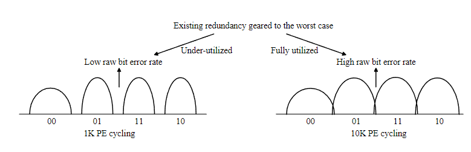
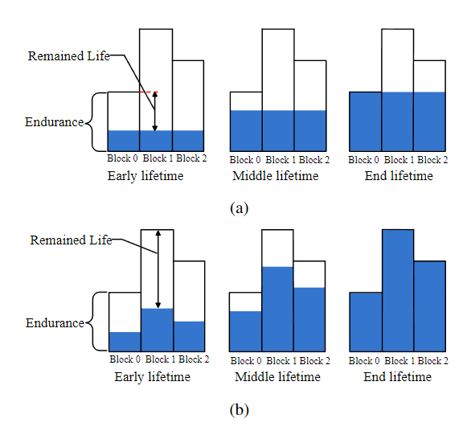
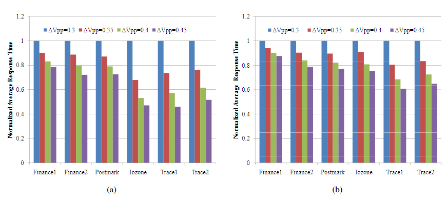
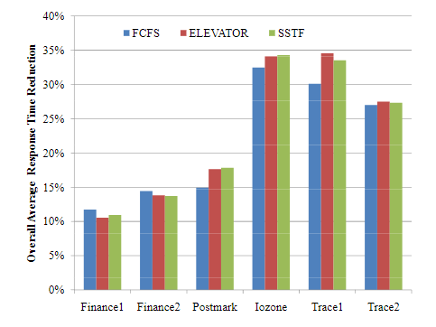
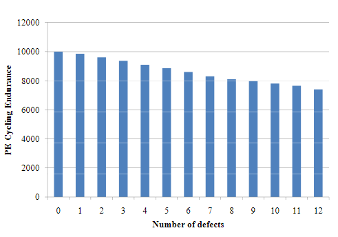
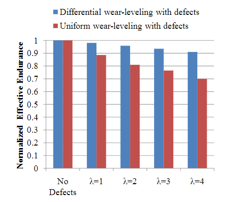
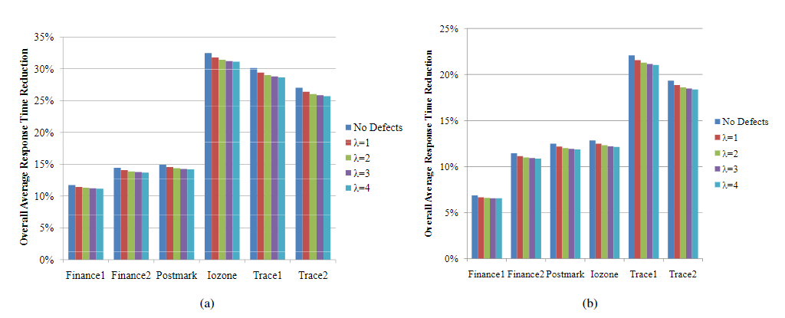

# Exploiting memory device wear-out dynamics to improve NAND flash memory system performance

这是美国伦斯勒理工学院发表在FAST11上的一篇文章，本文提出了一种设备感知设计策略，通过利用厂商预留的用于ECC校验的冗余存储单元来改进各种 NAND 闪存系统性能指标。

本文从两个角度探讨了这种设备感知自适应系统设计空间，包括：

1. 如何提高闪存编程速度
2. 如何提高内存缺陷容限（memory defect tolerance），从而提高闪存产量，减少晶圆的废弃。

为了实现定量评估，作者开发了一个 NAND 闪存设备模型，从系统级别捕获 P/E 循环的影响。论文使用基于 DiskSim 的 SSD 模拟器和各种跟踪进行模拟，结果表明 SSD 平均响应时间减少了 32%。论文进一步证明了有实现非常好的缺陷容限的潜力，最后表明这两种设计方法可以很容易地结合在一起，即使在内存缺陷率很高的情况下，也可以显著提高 SSD 的响应速度。

## Introduction

NAND 闪存单元会随着P/E循环逐渐磨损，这反映为存储单元存储噪声容限逐渐减小（或原始存储误码率增加）。为了满足指定的P/E循环次数，NAND闪存制造商必须制造足量的冗余存储单元，能够保证在标称的P/E次数内数据的可靠性。但是这些冗余的存储单元在闪存的整个生命周期内很大程度上都未被充分利用，特别是在闪存使用早期P/E次数较少时。

可以利用这些冗余在整个闪存生命周期内提高某些性能指标。为此，论文设计了一个近似的NAND闪存器件模型来捕捉PE损耗的因素。根据此模型，论文提出了通过冗余提高闪存写入速度和提高闪存缺陷的容忍来增加闪存产量的两种方案并进行了评估。

论文使用开发的NAND闪存模型进行了模拟仿真，仿真表明即使在高缺陷率的情况下也可以显著缩短SSD平均响应时间。

## Background

### 闪存P/E基础

每个 NAND 闪存单元都是一个浮动栅极晶体管，其阈值电压可以通过向浮动栅极注入一定量的电荷来配置（或编程）。NAND闪存中的数据存储是通过将每个存储单元的阈值电压编程到两个或多个非重叠电压窗口中来实现的。在一个存储单元可以被编程之前，它必须被擦除（即，去除浮动栅极中的电荷，这会将其阈值电压设置为最低电压窗口）。NAND 闪存使用 Fowler-Nordheim (FN) 隧道来实现擦除和编程，因为 FN 隧道只需要非常低的电流，因此可以实现高擦除/编程并行性。根据现有研究，已擦除存储单元的阈值电压倾向于具有类高斯分布。关于存储器编程，严格的阈值电压控制通常通过使用增量步进脉冲编程 (ISPP)  来实现，即，同一字线上的所有存储器单元都使用编程和验证方法递归编程阶梯式编程字线电压$V_{pp}$。

### P/E的影响

闪存 PE 循环以氧化物和界面态中电荷俘获的形式对浮栅晶体管的隧道氧化物造成损害，这直接导致阈值电压偏移和波动，从而逐渐降低存储器件噪声容限。此外，在 PE 循环过程中，被俘获在氧化物中的电子使擦除存储单元变得困难，从而导致更长的擦除时间，或者等效地，在相同的擦除时间下，那些被俘获的电子使擦除状态的阈值电压增加。大多数商业闪存芯片采用擦除和验证操作来防止擦除状态阈值电压的增加，但会随着 PE 循环逐渐延长擦除时间。

### 单元间干扰

在NAND闪存中，一个浮栅晶体管的阈值电压偏移可以通过寄生电容耦合效应影响其相邻浮栅晶体管的阈值电压。这被称为单元间干扰，已被公认为 NAND 闪存中的主要噪声源之一。

## System Design

在存储单元的早期寿命(即PE循环次数N相对较小)中，聚合的PE循环效应相对较小，导致存储单元的存储噪声余量相对较大，因此具有较好的原始存储可靠性(即原始存储误码率较低);由于内存单元原始存储可靠性动态，面向最坏情况的冗余将在整个内存生命周期的大部分时间内过度保护用户数据，特别是在其生命周期的早期，当内存单元操作噪声容限更大时。下图清楚地表明，冗余的内存单元基本上在内存早期生命周期未得到充分利用。

### 提高存储器编程速度

NAND 闪存编程是通过以编程步长电压 $\Delta V_{pp}$ 扫描整个存储单元阈值电压范围来递归执行的。因此，内存编程延迟与 $\Delta V_{pp}$ 成反比，这表明我们可以通过增加 $\Delta V_{pp}$来提高内存编程速度。然而，较大的 $\Delta V_{pp}$直接导致每个编程状态的阈值电压分布更宽，导致相邻编程状态之间的噪声容限更小，因此原始存储误码率更差。在当前的设计实践中，ΔVpp 是固定的，并且它的值足够小，以便 ECC 在 PE 循环达到其耐久性极限时能够容忍最坏情况下的内存原始存储误码率。结果，存储器编程速度基本保持不变，而原始存储误码率逐渐降低。在 PE 循环次数达到其持久极限之前，现有冗余未被充分利用。为了消除这种未充分利用的冗余，我们可以根据运行时 PE 循环次数有意增加程序步进电压 ΔVpp，以使内存原始存储误码率始终接近噪声容限，充分利用冗余内存，从而通过动态提高的$\Delta V_{pp}$来提升平均存储器编程速度。

### 提高闪存产量

随着业界发展，通过使用浸没式光刻或纳米压印等新光刻技术将 NAND 闪存芯片的制程提高到了 20nm级别，这种极其密集的存储阵列中的坏点不可避免地增加，传统的备用行/列修复技术可能变得不足以确保足够高的产量。

显然可以通过现有的 ECC 冗余来容忍内存缺陷，尤其是随机存储单元缺陷。但是，如果将部分ECC冗余用于缺陷容限，将无法确保指定的PE循环极限，导致PE循环耐久性下降。由于每个内存块中的所有页面都经历了相同数量的 PE 循环，因此每个块中的最坏情况页面（即包含最多缺陷的页面）设置了该块可实现的 PE 循环耐久性。如果我们试图保留某些 ECC 冗余来容忍内存单元缺陷，我们必须尽量减少对整体内存 PE 循环耐久性的影响。在当前的设计实践中，NAND 闪存使用磨损均衡在所有内存块之间均匀分布编程/擦除操作，以最大限度地延长整体内存寿命。由于具有不同数量的缺陷存储单元的不同存储块可以承受不同次数的 PE 循环，因此均匀的磨损均衡显然不是最佳选择。相反，我们应该让磨损均衡充分意识到不同内存块之间可实现的不同 PE 循环限制，这被称为差异磨损均衡，如下图所示，a图为传统的均匀磨损均衡，b图为本文提出的磨损均衡方法，该方法能够让闪存中的每个块尽可能同时达到寿命限制。

## Evaluation

### 写入速度提升

本文使用DiskSim中的SSD模块，并使用了6个工作负载跟踪。该模拟器可以支持使用多个可以并行工作的并行包，以提高 SSD 吞吐量。

上图显示了分别在4个并行包和8个并行包的情况下，6种工作负载在4 种不同的归一化程序步进电压$ \Delta V_{pp}$ 下的归一化 SSD 平均响应时间。结果表明，在不同的并行封装数量下，使用较大的程序步进电压可以提高SSD的响应速度。

在上述模拟时，使用了FCFS的调度方案，为了研究设计方法与调度方案之间的关系，论文还使用其他两种流行的调度方案重复上述模拟，包括 ELEVATOR 和 SSTF（最短寻道时间优先）。如下图所示，该设计方法能够在不同的调度方案下都能提高SSD的性能。

### 提高缺陷容限

下图展示了在不同数量的的存储单元缺陷的情况下P/E次数的极限值。

下图展示了在不同$\lambda$（每个最坏情况页面中缺陷存储单元数量的平均值）下，使用均匀磨损均衡和差异磨损均衡时的PE次数比率。随着$\lambda$的增加，差异磨损均衡策略的优势也会增大。

### 结合两种设计模式

上图展示了当SSD包含4个并行包和8个并行包时，在不同$\lambda$下对比baseline的性能提升。结果表明，当 ECC冗余也用于容忍有缺陷的存储单元时，我们仍然可以保持显着的 SSD 速度性能提升。

## Conclusion

论文研究了自适应地利用 NAND 闪存单元磨损动态来提高闪存系统性能的潜力，开发了一个闪存器件模型并使用基于DiskSim的SSD模拟器对其进行了评估。
