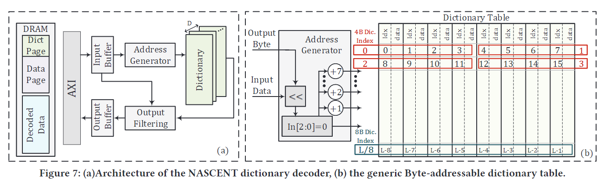

# NASCENT: Near-Storage Acceleration of Database Sort on SmartSSD

本文来自UCSD和三星的合作，作者是UCSD的Sahand Salamat，发表在FPGA‘21。本文提出了一种用于数据库排序的近存储加速器，NASCENT。它使用三星SmartSSD，一个带有板载FPGA芯片的NVME闪存驱动器，使用双调排序算法对数据库排序。随着存储设备数量的增加，NASCENT设备的性能和能源效率都在提高。在12块SmartSSD硬盘的情况下，与FPGA (CPU)基线相比，NASCENT的速度达到7.6× (147.2×)，能耗低达5.6× (131.4×)。

## Introduction

随着数据的爆炸式增长，在一些应用中，如数据库、图处理、机器学习和统计分析，超过一半的执行时间花在了数据传输上，这突出了数据通信对整体性能的影响。固态硬盘的快速发展已经将数据传输时间的瓶颈从磁盘(即寻道和旋转延迟)转移到互连带宽和操作系统开销。PCIe提供了对存储设备的有限的同时访问，这限制了在不同存储设备上并行调用独立操作时系统的可伸缩性。这个问题以及互连总线的低性能增加了存储设备和互连总线之间的性能差距，这迫使我们将计算移到更靠近数据存储的地方。这已经被近存储计算的发展所支持。

在本文中，为了对数据库表进行排序，提出使用SmartSSD进行近存储排序，SmartSSD包含基于FPGA的加速器和特定的内核，以加速字典解码、排序和随后的shuffle操作。如果表以编码格式存储，则新生字典解码内核对键列进行解码。然后，排序内核对键列进行排序，shuffle内核根据已排序的键列对表进行重新排序。与之前基于FPGA的排序加速器的目标是通过充分利用DRAM到FPGA的带宽来最大化性能相比，本文的挑战是存储带宽低于DRAM带宽。通过对字典解码内核、多shuffle内核和排序内核的合理分配FPGA资源，解决了I/O瓶颈问题。

## Background

### Computational Storage Drive

近存储计算将一部分计算转移到存储驱动器，以加速大数据应用。因此，为了将计算能力引入闪存设备，已经开发了新的设备，如NGD Systems、ScaleFlux和三星的SmartSSD。NGD系统公司开发了具有多核ARM处理器的计算存储，在NVMe存储设备中执行原位计算（在数据原来的位置）。ScaleFlux开发了具有内置GZIP压缩/解压功能的计算存储设备。SmartSSD是一款内置FPGA芯片的NVMe硬盘，可以在SSD内处理数据。FPGA作为SmartSSD的计算节点，具有高并行度、低功耗和可重构性，可实现多种应用。与一般处理核心(主机处理器)相比，FPGA以更低的功耗运行并行应用程序更快。

### 双调序列

在了解双调排序算法之前，我们先来看看什么是双调序列。 双调序列是一个先单调递增后单调递减（或者先单调递减后单调递增）的序列。

A bitonic sequence is a sequence with $x_0\le\cdots\le x_k\ge\cdots\ge x_{n-1}$ for some $k, 0\le k\le n$, or a circular shift of such a sequence.

e.g.（23,10,8,3,5,7,11,78）

### Batcher定理

将任意一个长为2n的双调序列A分为等长的两半X和Y，将X中的元素与Y中的元素一一按原序比较，即a[i]与a[i+n] (i < n)比较，将较大者放入MAX序列，较小者放入MIN序列。则得到的MAX和MIN序列仍然是双调序列，并且MAX序列中的任意一个元素不小于MIN序列中的任意一个元素[2]。

### 双调排序

假设我们有一个双调序列，则我们根据Batcher定理，将该序列划分成2个双调序列，然后继续对每个双调序列递归划分，得到更短的双调序列，直到得到的子序列长度为1为止。这时的输出序列按单调递增顺序排列。

见下图：升序排序，具体方法是，把一个序列(1…n)对半分，假设n=2^k，然后1和n/2+1比较，小的放上，接下来2和n/2+2比较，小的放上，以此类推；然后看成两个(n/2)长度的序列，因为他们都是双调序列，所以可以重复上面的过程；总共重复k轮，即最后一轮已经是长度是2的序列比较了，就可得到最终的排序结果。

对于任意序列的排序，我们可以按照类似的方法，将序列构造为双调序列，再进行排序，如下图所示。

UltraRAM是一种存储器技术,它是将非易失闪存 NAND、易失性内存 RAM 结合在一起,兼顾能效,具有极高的耐用性。

## NASCENT DESIGN

### SmartSSD Architecture

图1展示了SmartSSD的整体架构，它由通用的SSD、SSD控制器和NAND阵列组成，并附带了一个FPGA加速器和一个PCIe Switch，用于NAND和FPGA之间的通信。通过PCIe Switch，Host、NAND、FPGA三者之间都能直接访问。在SmartSSD中，处理器可以通过SSD驱动向SSD控制器下发常见的SSD命令，如SSD读写请求等。此外，CPU还能够通过FPGA驱动程序发出FPGA计算请求和FPGA DRAM读写请求。除了主机驱动的命令之外，SmartSSD设备还通过FPGA DRAM和板载PCIe Switch支持在其NVMe SSD和FPGA之间的内部数据路径上进行数据移动，我们称之为“点对点(P2P)通信”。P2P使计算接近数据永久驻留的位置，从而减少或消除主机到存储和主机到加速器的PCIe流量，以及相关的往返延迟和性能下降。SmartSSD提供了基于fpga的开发环境和运行时栈(运行时库、API、编译器、驱动程序等)，实现基于fpga的设计。

### NASCENT Overall Architecture

上图展示了传统的存储系统配备FPGA加速器的架构（左）与NASCENT的架构（右）。在传统的系统中，若系统存在加速器，主机要么从存储设备读取数据并传输给加速器，要么加速器直接从存储设备读取，前者的延迟明显比后者更大，对于后者，当数据存储在多个存储设备上时，这种架构的性能扩展性仍然很差。当前的数据库需要多个设备来存储数据。这些数据库比当前的商用硬件平台所能处理的数据库要大。当前的数据库需要多个设备来存储数据。这些数据库比当前的商用硬件平台所能处理的数据库要大。因此，数据库管理系统将数据划分为更小的块，以便计算节点能够以及时负担得起的方式在每个分区上执行计算。在排序数据库表时，NASCENT的目标是充分利用存储带宽。因此，在单个SSD上并行多个分区是没有好处的，因为它不会提高性能，因为在这种情况下，FPGA将需要频繁地在分区之间切换，因为它不能同时访问不同的分区。因此，NASCENT在SSD的级别上并行计算，如图2所示，在每块SSD中都有排序内核。这在传统架构中是不可能的。在传统的架构中，FPGA通过PCIe总线连接到存储设备，不能同时提供对多个ssd的访问。由于NASCENT包含排序、字典解码、Shuffle内核，通过如图2的资源使用，能够使三种内核都能消耗SSD到FPGA的最大带宽。

### NASCENT Sort Kernel

双调排序中的操作序列是预定义的、数据无关的和可并行的。因此，NASCENT能够利用FPGA的并行性来加速双调排序。输入序列存储在FPGA DRAM中，通过AXI接口将序列输入FPGA的输入缓冲区，其中能容纳$P=2^m$个整型。当缓冲区被填满时，数据被传递给$P-sorter$模块。

$P-sorter$是并行实现的，高度流水线化，每个时钟周期能提供一个大小为$P$的有序序列。根据双调排序的原理，$P-sorter$由$log_2P$步组成。第i步的比较、交换次数为$i\times \frac{P}{2}$,所以一共需要

个比较、交换模块。

$P-sorter$的输出被写入序列内存中，每排一次序，排序的方向（升降序）就会被改变。序列内存由$M_1$和$M_2$两个子内存块组成，使用FPGA BRAM实现。如b图所示，每行$M_1$和$M_2$包含$P$个元素，共同形成一个长度为$2P$的双调序列行。对于每一行，可以采用双调排序归并的方法，使用$P\times log(2P)$个比较交换模块排序。叫做2$P$-Merge。a图给出了合并$P-sorter$结果的步骤，b图为结果。合并的过程与双调排序的过程类似。当NASCENT完成了对整个序列内存的排序后，将其写入FPGA DRAM中，并使用相同的流重复获取和排序输入序列的另一个块，然后合并他们以构建更大的排序块。

为了满足带宽和并行性，$M_1$和$M_2$都由$P$列的BRAM组成（每个BRAM数据宽度（一个周期取出的大小）是32bit），这样同时能够取$P$个整数。同时，每个内存块中有$L$行BRAM，如上图b，$L=8$。BRAM数量和32位int的容量表示如下。

其中1024为BRAM的深度（总大小）。在每次迭代中，2048$PL$个整数被排序并写回到FPGA DRAM。要对数据库表进行排序，必须根据已排序键列的索引（称为已排序索引）对其余表行进行重新排序。因此，我们还需要生成排序后的索引，这些索引稍后将被 shuffle 内核用于对整个表进行排序。为此，当从 DRAM 中读取输入序列时，我们为每个元素分配一个索引，并将索引存储在与序列内存具有相同容量的索引内存中。当从序列内存读取并将输入输入到$P-sorter$时，NASCENT 读取相应的索引并连接到该值。$P-sorter$只比较元素的值，但同时交换值和索引。因此，NASCENT 也将排序后的索引存储在 DRAM 中。

图5展示了sort内核的架构。序列通过$P-sorter$模块进行排序后存入$M_1$和$M_2$中，之后每次同时从$M_1$和$M_2$中各取出一个$P$个元素的序列，进行Parallel Compare-and-Swap (PCS)或者2$P$-Merge。元素选择器由$L$-to-1 多路复用器实现，每次最多能从M_1和M_2中各取出2个序列。最后经过合并/比较，结果被写回序列内存继续执行图4(a)的步骤。

### NASCENT shuffle Kernel

根据数据表的某个字段排序之后，NASCENT使用shuffle内核对表行进行重新排序。通过读取排序后的索引来定位到原始表行的位置并将数据表进行重排。排序后的表项和原始表项之间的映射关系如下。

shuffle 内核不执行任何计算，因此，内核的性能受内存访问时间的限制，数据表的存储方式会影响性能。下图展示了数据表的几种存储方式，(a)图为传统的列式存储，(b)图为行式存储。列式存储适用于sort内核，因为只需要访问每一个表项的一个字段，而shuffle内核需要访问每一个表行，所以行式存储更加适用。为了优化两个内核的访问模式，NASCENT 使用混合技术将表存储在存储中。如(c)图所示，排序使用的字段k这一列通过列式存储，而其余表行按照行式存储。

### NASCENT Dictionary Decoding Kernel

由于数据表列中的条目通常具有相同的数据类型和重复的值，因此通常使用字典编码对列进行压缩。当列中的条目数显着高于唯一值(U)的数量时，字典编码是有效的。每个唯一值由k位的key表示，$k=log_2(U)$。 NASCENT提供了一个通用字典解码器，它支持具有各种位宽的输入和具有不同数据类型和可在运行时配置的位宽的输出。

图7展示了NASCENT字典解码器的架构图，字典解码内核首先读取DRAM中的字典页，然后读取编码数据页，并执行解码操作，最后将解码后的数据写回DRAM中，以供排序内核访问。在解码可变长度数据类型时，字典值的长度可能不同。由于每个时钟周期对字典表有多次访问，NASCENT 使用片上存储器来存储字典表。图 7(b) 显示了存储在 FPGA 片上存储器中的字典表配置。字典表是一个字节可寻址的内存，以支持读取和写入不同位宽的元素。字典支持可变长的寻址，例如黑色是每一个字节的地址，红色框中的是表示4字节元素时的地址，蓝框为8字节。数据页中的每个编码元素都是字典的地址，NASCENT通过地址生成器将每个输入转换为字典表地址。地址生成器将输入元素映射到字典表的地址，对于每个输入key，地址生成器生成与之对应的值所在的行的地址，并读入一整行，再通过过滤模块过滤出对应的值。例如图7(b)中，字典解码输出4字节的值，输入了一个字节的key 3，首先将key左移3位，就能够得到对应的起始地址，将末3位设为0，则12变为8，获得该行的首地址，读取整行后通过过滤模块将{12, 13, 14, 15}地址的值写回。

## Evaluation

### General Setup

实验使用的每个SmartSSD包含一个4TB SSD，通过PCIe 3.0 x4总线连接到Kintex FPGA。表一展示了SmartSSD的可用资源以及DRAM和SSD到FPGA的带宽。

为了测量整个数据库排序以及单个内核的性能，论文使用了 OpenCL 事件分析，记录包括FPGA和SSD中的P2P传输时间和计算时间在内的端到端时间。为了评估 NASCENT 的能效，我们测量了 FPGA（包括其片外 DRAM）的功耗，而不包括 SSD 的功率，因为我们在所有部署中都使用相同的 SSD。

### Kernel Evaluation

图8比较了当数据再CPU和FPGA的DRAM中可用时的性能对比。执行时间包括从 DRAM 中读取输入数组、对数组进行排序以及将排序后的数组写入平台 DRAM。输入序列是随机生成的，长度为 1000 个元素 (1K) 到 8,000,000 个元素 (8M)。NASCENT 的排序内核始终提供比 CPU 实现更高的性能。NASCENT 排序内核在 FPGA 片上 BRAM 块内最多可容纳 128K 元素。对于大于128K的输入需要写回DRAM，所以对于大于 128K 元素的输入，排序内核的相对性能改进会缩小（从排序 128K 元素的 7.5 倍到排序 256K 元素的 2.4 倍）。对于大于 1M 元素的输入，性能改进在1.8 倍左右。 SmartSSD 使用的是相对较小且低功耗的7.5W FPGA。因此，NASCENT 显示 1K 元素的排序输入的能耗提高了 61.3 倍。随着较大序列中加速的减少，对于大于 1M 元素的输入，能量改进达到13.6 倍。

图9比较了当数据存储在SSD中时，排序的性能，毫无疑问，再性能和功耗方面，CPU baseline依然被秒杀。NASCENT 的排序内核对于 1K 的小块输入显示了 6.6 倍的加速，当读取和排序 8M 元素时达到 8.25 倍的饱和。能耗（不包括 SSD 能量）也同样从 49.7 倍增加到 61.6 倍。

图10展示了字典解码器在不同位宽下的带宽，数据存储在SSD中。NASCENT 和 CPU 字典解码器内核都直接从存储设备中读取，临时存储到设备 DRAM，解码输入，并将解码后的数据写入设备 DRAM。NASCENT 字典解码器内核在所有情况下，除了 8 位输入和 64 位输出情况外，都实现了 3 GB/秒的输入带宽，这使 SSD 到 FPGA 的带宽饱和。当数据页是 8 位编码数据，值是 64 位数据时，输出带宽达到了DRAM的带宽，所以无法饱和输入带宽。

图11展示了排序8-32和8-64字典编码数据的情况下的运行时间。字典解码器内核的执行时间随着输入数组的大小线性增加，因为字典解码器内核的性能与数据无关。而在排序方面，由于排序内核一次能排序128K 32bit元素，相当于64K 64bit元素，所以在小于64K元素时排序时间相同，之后8bit-64bit的排序时间会增加。

图12展示了不同行列数量的情况下的排序时间。shuffle 内核充分利用了从 SSD 到 FPGA 的 PCIe 总线的带宽，以最大限度地减少 shuffle 时间。因此，NASCENT 的执行时间几乎随着表的大小线性增加。

### System Evaluation

为了评估 NASCENT 的可扩展性，在图 13 中我们展示了当 SSD 实例的数量从 1 增加到 12（12 个 SSD 是限制）时 CPU、配备 FPGA 的典型系统（见图 2）和 NASCENT 的执行时间由主机的插槽计数数量引起）。每个 SSD 包含一个表，表有 1024 行，平均行大小为 4KB。最初，键列由 32 位整数组成，但存储系统中的列存储为 16 位字典编码元素。

如图 13 所示，配备 FPGA 的系统基线和 SmartSSD 都比 CPU 基线快。所有平台的瓶颈都是存储带宽，处理器的内存层次增加了执行时间。将配备 FPGA 的系统与 SmartSSD 进行比较，当系统只有一个存储设备时，单机 FPGA 的性能略好，因为它比 SmartSSD 的 FPGA 更大，因此包含更多内核。然而，随着存储设备数量的增加，NASCENT 的执行时间保持不变，因为它独立地对表进行排序。然而，CPU 和 FPGA 基线无法并行处理不同 SSD 上的操作，因此它们的运行时间随着 SSD 的数量线性增加。在 SmartSSD 中，每个存储设备都配备了 FPGA，因此它比传统 SSD 消耗更多的电量。但是，SSD 的功耗高于 FPGA 的功耗，从而缩小了 SmartSSD 的每设备开销。NASCENT 拥有 12 个 SmartSSD，与 FPGA (CPU) 基线相比，速度提高了 7.6 倍 (147.2 倍)，能效提高了 5.6 倍 (131.4 倍)。

## Conclusion

本文提出了一个基于SmartSSD和双调排序的近存储加速器。NASCENT 解决了当前存储设备和计算平台之间的接口连接中的数据传输限制。NASCENT 包含具有特定内核的基于 FPGA 的加速器，以加速字典解码器、排序和随后的混洗操作以对数据库表进行排序。 NASCENT 通过在不同的存储设备上实现同时操作来增加计算机系统的可扩展性，并实现了不错的性能提升。
