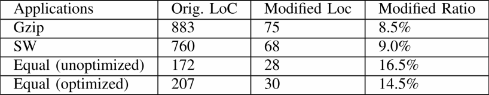

# Analyzing and Modeling In-Storage Computing Workloads On EISC — An FPGA-Based System-Level Emulation Platform

这篇论文由insider的原班人马发表在ICCAD'19，best paper。在ISC方向目前仍有两方面的问题亟待解决：（1）由于ISC的研究尚在起步阶段，业界没有专门的ISC平台用来统一比较不同应用下的各种性能；（2）何种具体应用适合采用ISC？何种具体应用不适合ISC？
本文在insider的基础上开发了基于FPGA的ISC仿真系统EISC，研究什么样的工作负载适合使用ISC。

## Introduction

近年来大热的一个话题是近数据计算，这一想法来自于host/drive interconnection与存储设备带宽之间的差距.存储带宽每两年翻倍但是PCIe总线扩增的速度却赶不上，ISC就是来弥补二者之间这一差距的。这样用于数据搬运的时间就大大减少了。
但目前市面上还没有成品的ISC驱动，许多研究工作都是在自己的平台上、参数也都是固定的。为了学术界和工业界开发一款开源的ISC仿真平台十分有必要，一方面学者缺少统一的评价系统，导致要重复大量他人的工作不利于ISC的研究进展；对于业界来说就面临一个“先有鸡还是先有蛋”的问题。只有当有一定成效的ISC架构提出他们才会投资。

为了解决这一两难的问题，本文提出了EISC，一个基于FPGA的ISC系统级仿真平台，尤其讨论了如何对虚拟的ISC drive进行仿真，EISC使用了带有DRAM的FPGA开发板，DRAM用来模拟存储芯片以及控制器的实现drive controller，FPGA则用来实现具体的应用，其中要满足的一点就是可配置的系统性能参数，EISC则是通过对一些idle signal的声明来使硬件实现的。
另一个问题就是哪些应用适合ISC架构，本文也基于EISC平台仿真了12种常见应用并进行了分析、总结。

## Background

### ISC的优势

ISC架构将计算从主机移动到驱动器，如图所示。控制器配备嵌入式计算单元，能够执行主机卸载任务。它在驱动器中执行第一轮计算，以便它可以利用高存储读取性能。开发人员卸载了数据过滤或缩减等计算模式，从而减少了输出数据量。这样，需要将更少的数据传输回主机。这缓解了从驱动器到主机互连的性能瓶颈。

同样的，ISC 架构使我们能够节省从主机到驱动器的互连带宽。开发人员首先卸载涉及数据放大模式的任务，例如文件解压缩。然后主机将数据写入执行存储计算的存储驱动控制器。将大于原始输入数据量的输出数据写入存储芯片；它利用了高存储写入性能。

### 基于FPGA的ISC系统

现有的许多工作（例如Ibex）都证明了FPGA对ISC的有效性。与 ASIC 相比，FPGA 可以定制以支持广泛的应用，实现通用 ISC。使用 ARM 或 X86 等处理单元，很难使可能高达数十 GB/s高存储带宽饱和。相比它们，FPGA通过硬件定制更容易达到性能目标。最后，由于存储驱动器是低功耗设备，ISC计算单元需要有较低的功耗。与 GPU 相比，FPGA 可以实现更好的能效。

本文就是针对基于FPGA的ISC系统。

## Motivation

目前市场上还没有通用的可编程 ISC 驱动器，原因主要有

1. 目标应用的局限。现有的工作针对一些特定的应用来展示ISC的优势，但是它们未能显示不适合ISC的案例；这种架构的普遍性仍然未知。另一方面将某些应用换用新的结构也要费不少工夫，因此急需对ISC统一的的量化和评判标准。
2. 固定的系统设定。现在一些ISC的实现都是基于一些固定的参数，但不同的storage driver、host system等都会高度影响ISC的性能，目前的ISC架构都是基于固定的实现，极不灵活也没有可比性。
3. 未提供开源支持。都是基于自己搭建的平台实现的，没有公开的仿真平台也导致了工作之间不能进行统一的对比。

## Design and Implementation

为了解决上述的问题，本文构建了EISC。它实现了：

- 端到端的系统仿真。比只进行功能仿真更具有实际意义；可以创建一个真实的系统模型，与软件配合应用到实际的应用场景中
- 系统参数的可配置性。比如bus的带宽和时延。EISC通过下面两部分完成：1是采用PCIe接口二是在DMA controller和storage controller中加入了延时和throttle unit
- 易于端口应用
- 开源

#### EISC 驱动设计

Fig2的上半部分展示了驱动结构，包含DMA controller,storage controller以及drive controller。

- PCIe接口:采用PCIe 3.0 x16，通过DMA控制器种的延迟和节流单元来模拟SSD的性能。
- DMA controller:位于drive controller和PCIe总线之间，主存发送的数据和指令通过DMA controller送到硬件驱动上，为了完成“可配置”这一目标还引入了delay & throttle units。来对经过PCIe的信号进行延迟。
- Storage controller。EISC中用DRAM芯片模仿存储阵列，然后storage controller是用来辅助drive controller访问存储阵列的，然后采用了多组互不相连的DRAM用于模仿存储阵列的多通道。
- Drive Controller:包含firmware和加速核两部分，其中firmware完成指令到地址的映射，加速核用来完成ISC逻辑，是EISC独有的部分，加速核通过firmware完成与storage和DMA controller之间的通信完成数据的读写。

### EISC Host Stack

可以通过RTL内核或HLS内核进行编译。用户提供的 HLS 内核从 input_channel 获取输入，执行计算，并将输出写入 output_channel。它可以接受来自 args_channel 的主机发送的运行时参数。它还可以使用驱动嵌入式 DRAM 通过 DRAM 访问接口存储中间结果。

EISC内核分为读内核和写内核。对于 ISC 读内核，其 input_channel 存储从仿真存储芯片读取的数据，而 output_channel 存储将通过互连总线发送回主机的数据。对于 ISC 写入内核，上述绑定是相反的。

最终硬件实现平台是AWS F1，通过该FPGA实现EISC的驱动部分，随后通过PCIe接口完成和host之间的连接

随后F1板子上配备的四块16G DRAM用来模拟存储芯片+accelerator kernel，两块用来模拟storage chip两块用来作为accelerator，并把加速部分地址空间限定在4G；最后EISC驱动的所有硬件逻辑部署在F1 FPGA上。

## Evaluation

在这一部分主要回答以下5个令人关心的问题：

1. 代码改动程度？
2. 不同系统配置对加速（性能）的影响？
3. 哪些应用程序可以从（基于FPGA的）ISC架构中受益？
4. 做出特定应用适合不适合ISC的定性或量化指标是什么？
5. 对于适合使用ISC架构的应用所需的合适带宽是多少？

下表列出了在evaluation中用到的算法、应用。

### 移植FPGA程序

下表列出了将FPGA程序移植到论文的框架中所需要修改的代码量，可以看出还是比较少的。

### ISC架构和解耦架构

在这一部分，论文将如下图所示的ISC架构与解耦的架构性能进行对比，对比在不同互联带宽(PCIe 3.0x4/x8/x12/x16)与硬盘速度（4/8/12/16GB/s)的情况下，最终的数据传输速率，以此来看出什么样的任务适合在ISC架构上执行。

结果总结如下：

在各个带宽设置下，AES、Gzip、SW、Equal(O)、Stencil、Conv在ISC架构上相较于解耦架构都不能有效提升性能。

### 选择ISC应用的经验法则

本文发现ISC不友好的应用程序主要受到两个瓶颈的影响。

#### 互联瓶颈

让$D_I$表示host和device间的数据传输大小，$D_D$表示device和SSD之间的数据传输大小，下图列出了每种工作负载下，$\frac{D_D}{D_I}$的值，对于AES、Equal(O)、Stencil和Conv，这个值为1，说明经过计算，计算结果与原始数据大小相近。在这种情况下，虽然内部驱动器带宽高于互连带宽，但我们无法利用它;原因是我们需要通过慢速互连传输相同数量的数据，这限制了整个内核的执行。

#### 计算瓶颈

论文还提取了内核的计算速度，如下图所示。

可以看到，Gzip和SW的计算速率低于4GB/s，即使在PCIe3.0 x4的带宽下，都无法跑满，所以这类工作负载就受到计算速度的瓶颈影响。

根据这两个瓶颈，论文将工作负载分为了4类，X轴是[Roofline](https://dl.acm.org/doi/10.1145/1498765.1498785)中定义的计算难度，Y轴为相关数据比率（设备内部传输的数据量与传输给host数据量之比）。ISC适合的工作负载应当是低计算难度（否则会受到计算瓶颈）和高相关数据比率（否则会受到互联带宽瓶颈）的。

### 流水线化的设备内核的分析模型

假设FPGA开发人员构建了一个加载-计算-存储流水线，以重叠这三个阶段的执行。各个阶段的时间建模如下：

$Width_{Data}$是内核每个时钟周期能处理的数据宽度。在EISC中为64字节。组合这5个公式，能够得到

其中$γ=Size_{DriveData}/Size_{PCIeData}$表示相关数据速率。

同样的，对于解耦的架构，可以得出

根据$BW(Drive)\ge BW(PCIe)$，$T_{ISC}\le T_{Decoupled}$等价于

它的充要条件是

这个公式给出了工作负载在什么情况下适用于ISC架构。但是，它没有回答另一个关键问题，即应用程序可以有效利用的存储带宽阈值是多少？显然，在临界点之后，应用程序无法再使存储带宽饱和。临界点由以下公式确定：

它的充要条件是

#### 模型的局限性

由于该模型假设 FPGA 内核的流水线执行，因此如果内核不是以流水线方式构建的，它将不准确。见以下两种情况

##### 1. The Kernel is Not Optimized

计算内核没有进行流水线优化

##### 2. Application Inherently has a Non-Pipelined Execution Region

应用本身具有非流水线的执行区域

## Conclusion

论文提出了EISC，一个开源的系统级ISC仿真模拟器。通过仿真基于 FPGA 的 ISC 架构，使用户能够灵活地探索 ISC 在不同应用下的优势，驱动器性能和互连性能。将现有FPGA程序移植到EISC中的努力是适度的。论文还提出了选择适用于ISC应用的经验法则以及流水线驱动内核的分析模型。我们评估了它们在 12 个常见工作负载中的有效性，以及模型在某些特殊情况下的局限性，并对根本原因进行了分析。