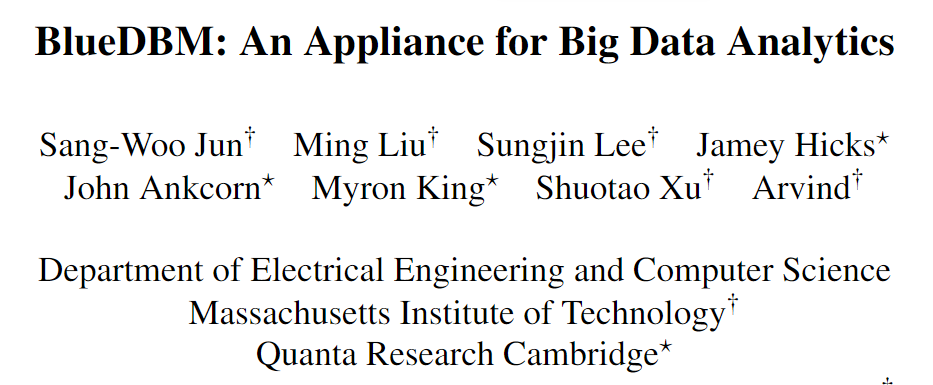

BlueDBM是麻省理工学院Sang-Woo Jun等人发表在2015年ISCA会议上的论文。该篇论文的启发点似乎来自于RAMCloud，该团队发现完全基于DRAM的系统的高功耗和每GB DRAM高成本的不足，而提出了一个能解决该问题带来较低成本又能带来很好的性能的BlueDBM系统架构。

传统的数据存储在磁盘，存储访问延迟和吞吐量是主要的关注点。历史上，我们通过以高度序列化（sequential）方式来组织数据的处理过程来缓和存储访问延迟和吞吐量。本文提出的思想角度来自复杂查询并不总是可以被组织成顺序数据访问方式，因此这类查询的高性能实现带来了巨大的挑战。一种解决方式如RAMCloud，该集群有足够多的DRAM集合来存储整个数据集。而本文提出了一个更便宜的可替代方案，这里在一个有着分布式Flash存储的单个基架（rack）中，可以以合理的效率来进行大数据分析（Big Data analytics）。Flash存储比磁盘有更好的随机访问性能。

BlueDBM提供功能如下：

1. 拥有足够的Flash存储的20个节点的系统来支持高达20TB的大数据工作负载；

2. 近统一（Near-uniform）的延迟访问一个存储设备网络形成了一个全局的地址空间（global address space）；

3. 能够实现用户定义的in-store 处理引擎；

4. Flash卡设计使一个接口能够在Flash访问时面向特定应用程序作出优化。

BlueDBM不含糊地建立了一个架构，该架构的price-performance-power特征提供一个诱人的可供选择的方案，那就是能够提供如ramcloud相似规模的应用。本论文的主要贡献如下：（1）设计实现了一个基于Flash可扩展的系统，该系统由一个全局地址空间，一个in-store的计算能力以及一个灵活的inter-controller网络。（2）一个软硬件协同设计环境用于合并许多用户自定义的in-store处理引擎；（3）性能测量显示该结构优势在于用Flash替代磁盘；（4）一个复杂数据分析器具具有更便宜并且消耗比基于云的系统的少一个数量级的电能。

SSDs价格比DRAM便宜一个数量级，性能比磁盘好一个数量级。许多商用的SSD设备接受了高性能的PCIe接口为了克服为硬盘设计的更低的SATA总线接口。

## 系统架构

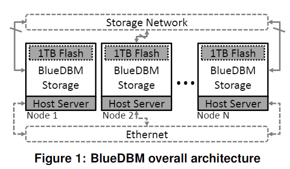

如上图所示是BlueDBM的系统架构。每一个BlueDBM存储设备通过PCIe接口嵌入到host server中，它构成了Flash存储，一个in-store 处理引擎，多个高速网络接口以及一个on-board DRAM。Host Servers通过以太网或其他通用网络连接在一起。主机服务器能通过基于PCIe的主机接口来访问BlueDBM存储设备。内置（in-store）处理器能够执行数据计算。In-store处理器可以访问四个主要部件：Flash接口，网络接口，主机接口和on-storage DRAM 缓冲。如下图2所示。

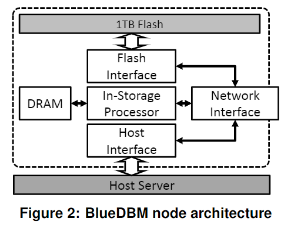

  本文实现了一个带有标签重命名的Flash Interface Splitter来管理多个用户，如下图3所示。

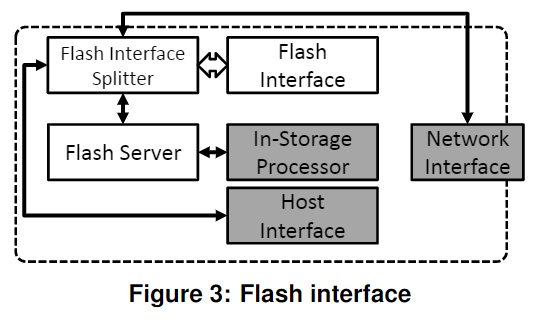

如下图4所示，呈现了一个网络结构。交换机有两层，分别是内部交换机和外部交换机。

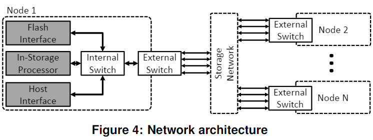

图7描述了Flash读操作的主机接口结构。

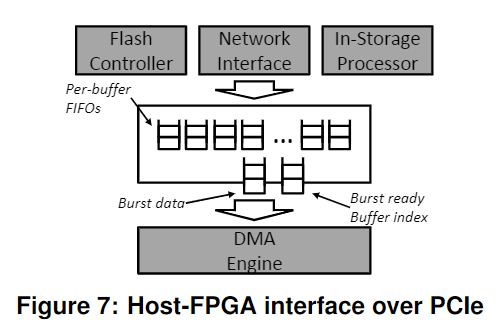

## **软件接口**

软件结构如图8所示，有三个接口可供用户程序使用，分别是（1）文件系统接口；（2）块设备接口；（3）加速接口。

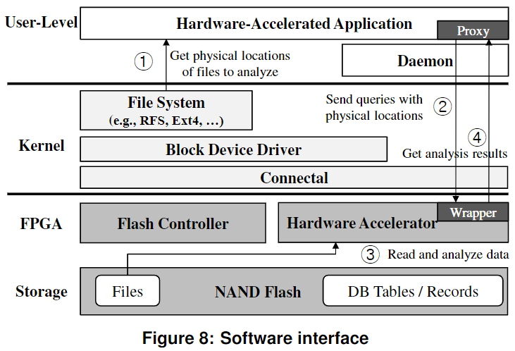

RFS实现了FTL的某些功能，包括逻辑到物理地址映射以及垃圾回收机制。这个能以更低的内存需求而获得更好的垃圾回收效率。在BlueDBM中的文件系统接口就是采用了RFS同样的范式。为了更有效的共享硬件资源，BlueDBM运行一个调度器（scheduler）分配可用的硬件加速单元来完成用户应用。

## 硬件实现

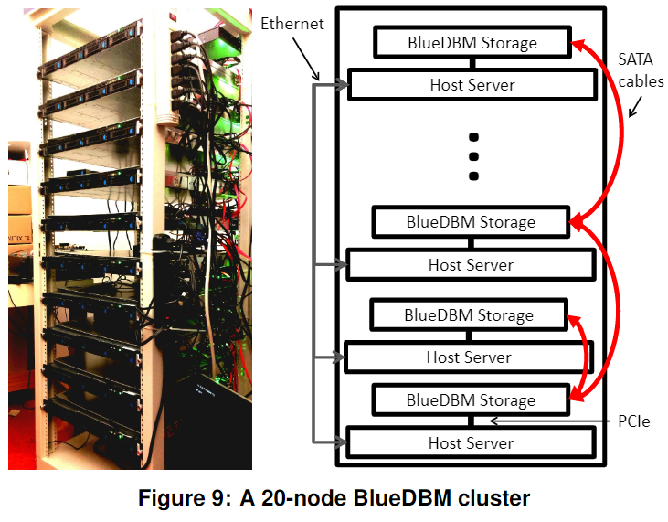

如上图9所示是BlueDBM的硬件实现。作者们使用了现场可编程门阵列（FPGA）来实现该In-store处理器，该架构还包括Flash、host和network控制器。然而，BlueDBM架构不应该局限于基于FPGA的实现，这里BlueDBM是通过高级硬件描述语言Bluespec来开发的。该集群由20rack-mounted Xeon服务器组成，每个服务器有24个核并且有50GB的DRAM。每一个服务器有一个Xilinx VC707 FPGA开发板通过PCIe接口连接。Host 服务器基于UBuntu版本的Linux。

如下图10所示是一个单节点的各部件组成。众多服务器中的一个有512GB的Samsung M.2 PCIe SSD用于性能比较。Connectal的PCIe实现限制1.6GB/s读和1GB/s写。未来作者们会探索更快速主机link的好处。

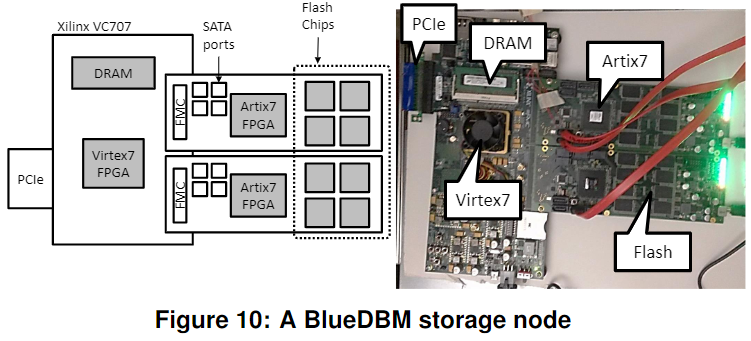

## **性能评价**

FPGA在两个Artix-7芯片上的资源使用情况如下表1.

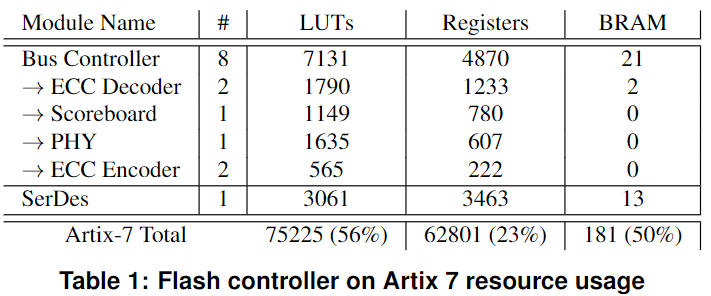

  在VC707板上的Virtex 7 FPGA芯片的资源使用情况如下表2

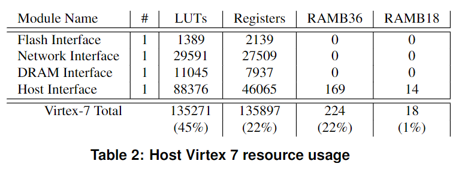

  由于FPGA和Flash设备更低的能耗，BlueDBM能够为该系统减少20%的电能消耗。表3显示了该系统的整体能量消耗情况。

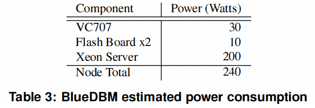

  如下图显示了远程存储访问延迟如下：

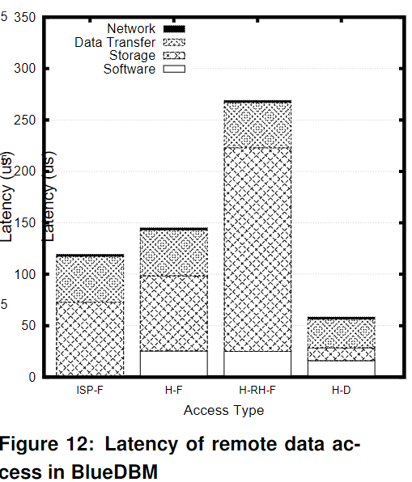
