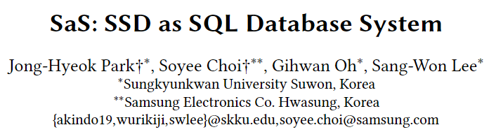
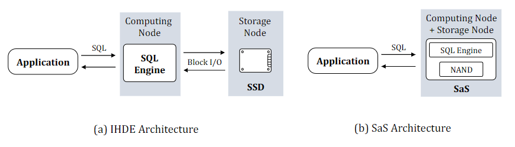
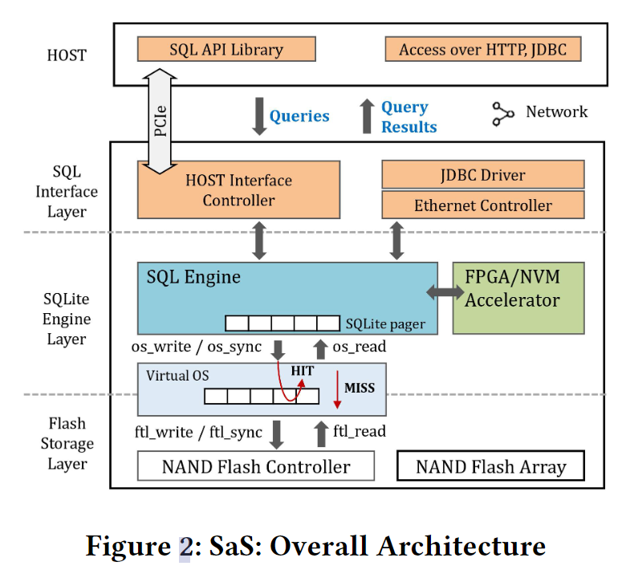
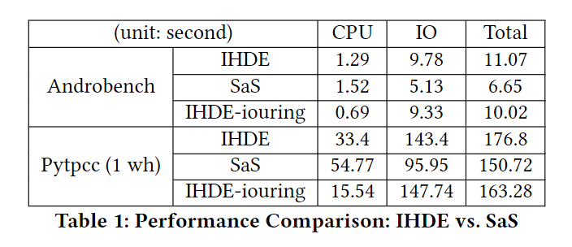

这是成均馆大学和三星合作发表在VLDB'21上的一篇论文。这篇论文的main idea就是将数据库引擎和SSD结合起来，让引擎跑在SSD内部，利用SSD的计算资源从而节省一些IO堆栈方面的开销。

### 一、背景

##### 1.In-Storage Processing

自20世纪70年代末以来，就有大量的ISP方案被提出，近些年来又成为了研究热点。

##### 2. SSD的普及

在过去的十年中，SSD由于具有诸如快速延迟、高IOPS/美元和低功耗等优点，一直在不断地取代硬盘作为主要存储介质。而这会侵蚀内存系统的一些关键优势。

### 二、问题

1. 当使用低延迟SSD作为存储节点时，传统的主机内数据库引擎（in-host database engine）架构会有以下问题：
   1. 遗留的I/O堆栈开销对SSD的性能有一定损耗。即使有大量的I/O堆栈优化或从用户空间到存储的直接访问方案，系统调用和内存复制等开销仍然是不可避免的。
   2. I/O堆栈将阻碍数据库引擎和SSD之间的垂直优化，因为根据现有工作，实现跨I/O堆栈的优化是很困难的。
   3. 在云环境中，虚拟化层延长了数据库引擎和存储之间的I/O堆栈。由于将存储从计算中分离出来进行弹性计算和独立伸缩，解耦后的计算和存储之间的网络延迟会加重IHDE的数据移动开销。
2. 几乎所有现有的ISP都将特定的数据密集型操作(如选择、连接和聚合)部分地卸载到存储上，而数据库引擎的主体驻留在主机上，因此仍然必须与存储设备交互。

### 三、设计思路

#### 将完整的数据库引擎全部下推到SSD上，并与SSD架构紧密集成运行。

如下图所示，a图为传统的主机内数据库引擎架构，b图为SaS的架构。在SaS架构中，完整的数据库引擎(如SQLite)全部下推到SSD上，提供SQL作为主要的接口，其他计算节点上的应用程序可以在没有任何干预主机内SQL引擎的情况下，通过网络或其他介质直接与SSD本身交互。

##### **设计优势**：

通过将一个完整的数据库引擎嵌入到SSD中，SaS将作为一个数据库服务器而不是虚拟块设备，从而消除IHDE架构导致的低效率。首先，通过将一个完整的数据库引擎卸载到SSD中并将两个层紧密集成，SaS将避免I/O堆栈开销，并在SQLite引擎和FTL层之间实现很多垂直优化。此外，由于一个SaS设备可以同时扮演计算节点和存储节点的角色，从而可以取代分离的主机和存储。

##### **目标应用：**

考虑到当今SSD中CPU和DRAM的有限资源，可以预见的是，SaS不会在企业级应用中与现有的IHDE架构竞争，但是对于边缘计算、物联网和智慧城市等众多新型应用，SaS可以发挥作用。这些应用的工作负载大多是数据密集型，具有间歇性、突发性和不可预测性。

##### **设计目标：**

本文针对上述的挑战，设定了三个设计目标。下图展示了SaS的整体架构三个设计目标分别是对应图中的一些部分。

**1. SSD上的SQL接口**

SaS支持将SQL作为他在PCIe和网络（例如JDBC）上的主要接口。

**2. 垂直I/O优化**

SaS的第二个设计目标是消除I/O堆栈开销，并探索SQLite引擎和闪存存储层之间的各种垂直I/O优化。这一目标可以通过将数据库引擎与FTL集成来实现：引擎绕过内核I/O堆栈，直接与FTL交互。

**3. 硬件辅助加速**

SaS的第三个设计目标是通过利用CSD可能存在的硬件资源来加速其性能，例如通过FPGA能够加速一些SQL引擎中的关键操作。

### 四、设计细节

作者在Cosmos+ OpenSSD上实现了一个简单版本的SaS原型叫做SaS-Zero，采用SQLite作为数据库引擎，整体架构如上图2所示。下面介绍一下图2中的每个部分细节。

**1.SQL接口层**

SaS-Zero支持通过存储接口(PCIe)和网络接口使用SQL语言访问。接口主要通过NVMe中的nvme-io-passthru这个命令来实现，该命令允许提交任意IO命令。主机端应用程序可以通过新指定的SAS命令向SAS发送SQL语句和以及接收结果。这些命令的格式与现有的NVMe读/写命令几乎相同。

**2. SQLite和虚拟OS层**

SQLite依赖几个操作系统功能，如文件I/O和内存管理。但是OpenSSD目前不支持任何操作系统。作者通过将SQLite中的操作系统功能重定向到扩展的 Vanilla FTL中，来实现。

### 五、实验

下图是分别在IHDE和SaS模式下使用SQLite运行两个基准测试的CPU和IO时间。可以看出SaS在IO时间方面大幅领先于传统的IHDE架构，虽然受限于CPU性能，CPU时间略有增长，但是总时间的减少还是很可观的。

IHDE-iouring是为了探究主机IO栈对IHDE架构影响做的对照组，使用io_uring来代替Linux中的IO栈，查看IO栈优化的影响。

